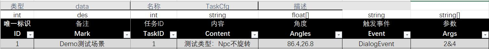
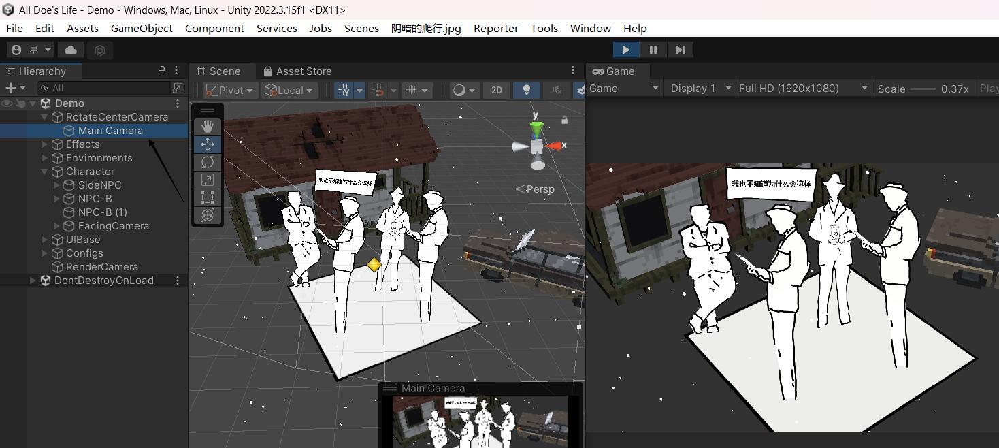
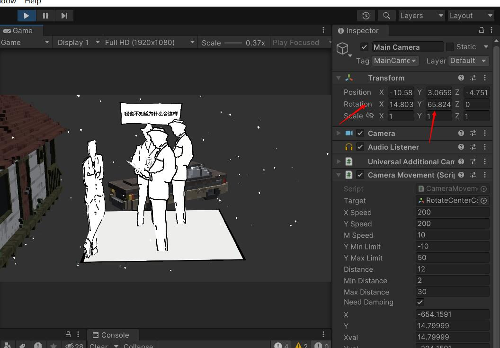

Task配置表使用说明文档

> 更新于2023.12.17  第一版 配置表

表数据类型:

- ID  : 该任务的唯一ID  
- des:  备注列可随便填写（不会生成到实际的数据中）
- TaskID : 任务ID  （唯一值）
- Content : 任务内容文本描述 （暂未实装到游戏）
- Angles：  该任务要求的旋转角度 （下面会具体教怎么看）
- Event： 该任务完成触发的事件（具体可以看事件表）
- Args： 事件携带的参数

_____________________________________________________

任务表Angles查看方法：

1.选中游戏场景左侧的Main Camera组件  

​    拖动MainCamera组件到合适的位置（符合该任务的合适位置）

2.该相机的Rotation中的X与Y值就是该任务完成所需的角度参数

（选取任务的完成值的时候，最好选取中间位置，在判断过程中会允许正负20的范围误差）

