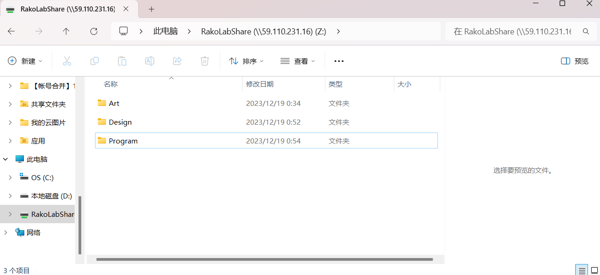

# **RakoLabShare共享文件添加方法**

1. @打开 [此电脑]  
2. 右键[网络] —> [映射网络驱动器]
3. 在文件夹一栏输入  **\\\59.110.231.16\RakoLabShare**  (勾上   下面两个选项  )
4. 点击完成   会提示需要登录账号密码

> 账号:69dbda7
>
> 密码: rakolab@000
>
> 
>
> 账号:charley
>
> 密码: rakolab@000

（请不要登录其他人的账号   *阴暗的爬行）

5. 登录完成尽情共享

*暂时分了三个文件夹Art、Design、Program可以在自己的文件夹里面存放一些x，空间十分有限！（总共是4G）*

